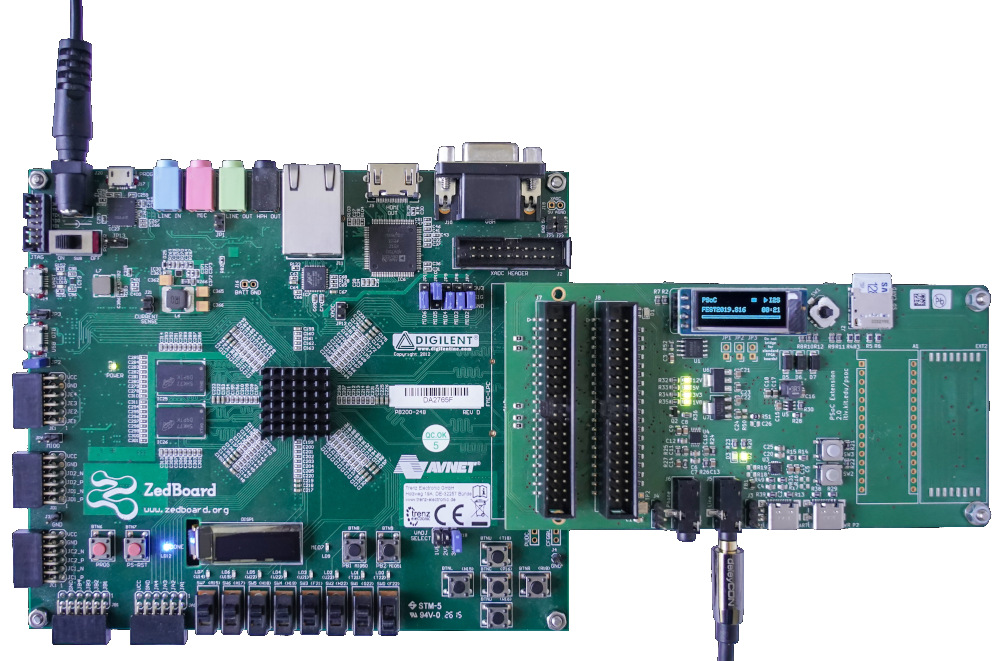

# PSoC ZedBoard Vitis Project

This repository contains a Vitis project for the [psoc-soc](https://github.com/kit-kch/psoc-soc) Xilinx bitstream.
Whereas the bitstream can be directly programmed using JTAG, when you want to load it from SD card or the SPI flash on the Zedboard, you'll have to use Vitis.

## Updating the FPGA Bitstream

Open the [psoc-soc](https://github.com/kit-kch/psoc-soc) project in Vivado and generate the bitstream for the ZedBoard.
Instead of programming, run `File` → `Export` → `Export Hardware`.
Make sure to select `Include Bitstream` and change the location to somewhere where you'll find the file later.

Then open Vitis.
You can use a newer Vitis version, the version tested was `2025.1`.
Run `File` → `Set Workspace` and select the folder where you checked out this repository from git.
Select `psoc_platform` → `Settings` → `vitis-comp.json` in the project tree on the left.
Click `Switch / re-read XSA` and select `psoc_soc_top.xsa` from the folder into which you did the `Export Hardware` step in Vivado.

## Compiling and Bundling the Application

To compile the PS application (a simple hellow worl that flashes LD9), select `hello_world` in the project tree on the left, then click `Build` on the bottom left.
You can now run the application and debug it.

If you want to flash to QSPI Flash or SD Card, we have to bundle the PS application, bootloader and the bitstream.
Press `Create Boot Image`.
Keep all settings as is and specify the output BIF File Path, e.g. as `psoc.bif` in the repository root folder.
The `BOOT.bin` file will be generated automatically in the same folder.
Finally, press `Create Image` and wait for the process to finish.

## Flashing the SPI Flash

In Vitis, run `Vitis` → `Program Flash`.
Keep all settings as is.
For `Image File`, select the `BOOT.bin` you created in the previous step (or download one from the releases here).
For `Iniit File` you should select `psoc_platform\zynq_fsbl\build\fsbl.elf` from your workspace folder.
It's probably best to check `Verify after flash` as well.
Finally click `Program` and wait for the process to finish.

Note: Manuals say you should set the jumpers to JTAG mode (Set `MIO2`-`MIO6` to `GND`) for flashing.

## Configuring the ZedBoard

After you flashed the QSPI flash, you have to set the jumpers correctly to make the ZedBoard boot from SPI flash.
Set `MIO5` to `3V3`. `MIO6` and `MIO2`-`MIO4` should all be set to `GND`.

When you now power-on the Board, you should see the FPGA getting configured, the `DONE` Led signalling that programming was ok and the `LD9` led blinking to show that the `hello_world` code is running on the PS.

## Further Reading

You'll find a lot of old, outdated documentation for the ZedBoard and for Flash programming...
These sources here are up-to date as of 2025:

* [ZedBoard User Guide ZedBoard_HW_UG_v2_2.pdf](https://files.digilent.com/resources/programmable-logic/zedboard/ZedBoard_HW_UG_v2_2.pdf)
* [How to use Vitis for embedded applications](https://www.adiuvoengineering.com/post/microzed-chronicles-introducing-vitis-unified-ide)
* [Creating a Baremetal Boot Image for Zynq-7000 Devices](https://digilent.com/reference/programmable-logic/guides/zynq-baremetal-boot)

Some final words of warning: If you want to use a custom bitstream, you **must**:
* Ensure that it contains a block design, otherwise `Export HArdware won't work`
* Make sure the block design contains the `PS7` block, otherwise Flash programming and booting won't work
* Make sure that your project is configured to use the `ZedBoard`, selecting the FPGA part is not enough! (You can change that later though, after you configured the PS7 block)
* Note that the board file for `Zedboard` are not shipped with Vivado. You need to get them from Digilent and install according to their documentation.
* With the board set up correctly, run `Block Automation` in the block design. Make sure the `Apply board preset` or something like that box is checked.
* This will provide proper initial configuration for the PS7. Vivado will complain about some DDR delays being negtaive though. I just set those to 0...
